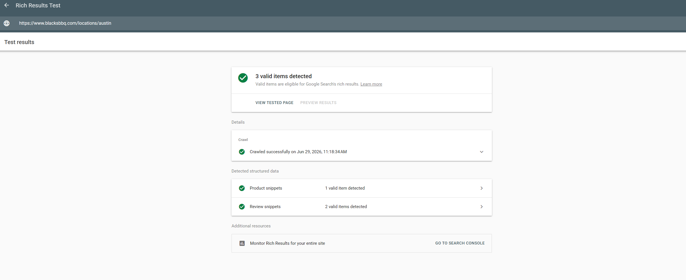
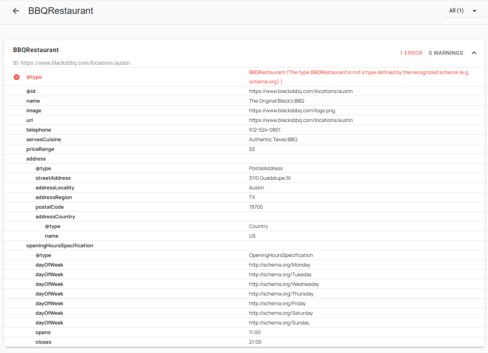
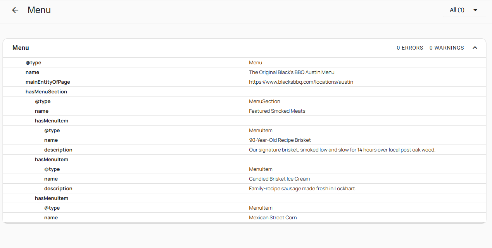
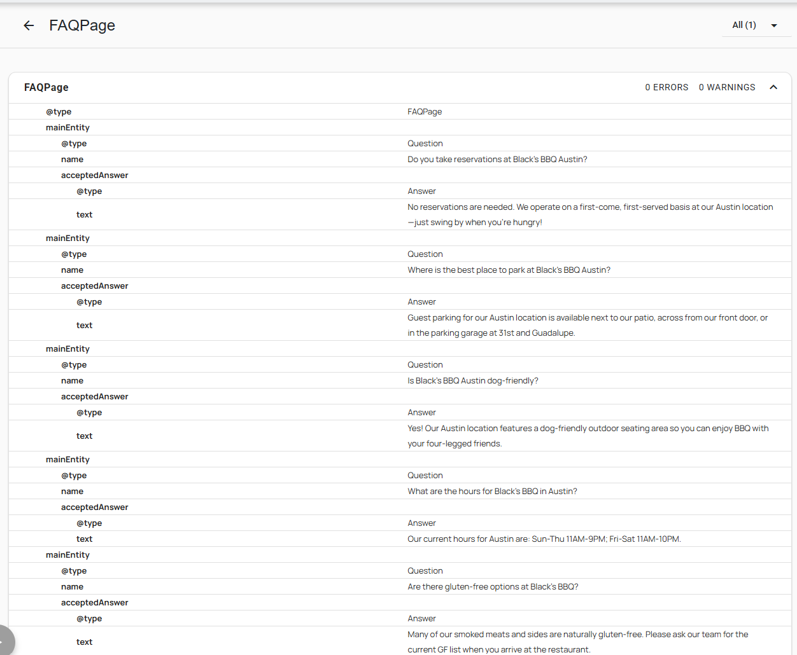

# GTM AI-Readiness Implementation — The Original Black's BBQ

## What It Is

A Google Tag Manager implementation that makes a 4-location Texas BBQ restaurant's website AI-ready — injecting structured schema data that tells Google's AI models exactly what each location is, where it is, and how to send customers there. Built alongside a companion Google Ads audit; this project focused on the technical infrastructure underneath the campaigns.

---

## The Problem

By 2026, AI-powered search (Google's Search Generative Experience, Gemini) no longer just crawls text — it maps **entities**. A restaurant's online presence needs to function as a structured database, not just a collection of pages, or it gets ignored by AI-driven results.

Black's BBQ had four locations — Austin, Lockhart, New Braunfels, and San Marcos — but the website had no structured data telling Google's AI:
- Which page corresponds to which location
- What the address, phone number, and hours are for each one
- How to route a customer to the online ordering system

At the same time, the Google Ads account had a blind spot: users who blocked cookies were invisible to Smart Bidding. If a customer found the restaurant through an ad but rejected cookies, that conversion was lost — and the bidding algorithm was making decisions on incomplete data.

---

## The Solution & Impact

Built a complete AI-readiness implementation inside Google Tag Manager — no changes to the website's source code required.

**1. Dynamic BBQRestaurant Schema (JSON-LD)**

Implemented a single GTM tag that injects location-specific schema automatically based on the URL:

- **RegEx Table variable (`RegEx - BBQ Location Data`)** — keyed off `{{Page URL}}`, outputs a JSON string with city, zip, street, and phone for whichever location the user is on (`.*austin.*` → Austin data, etc.)
- **4 Custom JavaScript parsing variables** — pull individual fields from the JSON string via `JSON.parse()`, each wrapped in `try...catch` to fail gracefully if a URL doesn't match (returns `undefined`, not a broken string)
- **Custom HTML tag (`cHTML - JSON-LD - Restaurant Schema`)** — injects `BBQRestaurant` JSON-LD using those parsed variables, including address, phone, hours, cuisine type, and an `OrderAction` block pointing to the Toast online ordering URL
- **Trigger scoped to location pages only** — fires on `Some Page Views` where `Page URL matches RegEx austin|lockhart|new-braunfels|san-marcos`; homepage and blog posts are excluded by design

Result: when Google's AI model indexes any location page, it sees a structured data feed — not just text — telling it exactly what that location is.

**2. Google Ads Enhanced Conversions**

Set up a `User-Provided Data` variable in GTM mapping customer email from the Toast order confirmation page. This hashed first-party data is sent back to Google Ads alongside each conversion, improving Smart Bidding accuracy for users who operate in a cookie-restricted environment.

**3. Consent Mode v2**

Implemented a `Consent Initialization` tag that fires before all other tags, setting default consent states (`ad_storage='denied'`) and enabling `ad_user_data` and `ad_personalization` signals per Google's 2026 privacy framework. When a user denies cookies, Google's modeling layer uses the cookieless pings to estimate conversion activity — preventing Smart Bidding from going blind on privacy-conscious users.

---

## Tech Stack

`Google Tag Manager` · `Schema.org / JSON-LD` · `Google Analytics 4` · `Google Ads` · `JavaScript (Custom JS Variables)` · `RegEx`

---

## Demo / Screenshots

**Rich Results Test — Austin Location (live)**

The `BBQRestaurant` schema tag is confirmed live on `https://www.blacksbbq.com/locations/austin`. Google's validator detects the entity with all fields correctly populated: name, address, phone, cuisine type, price range, and hours — all pulled dynamically from the GTM variables.









> **Note on the `@type` validator error:** The Rich Results Test flags `BBQRestaurant` as "not a recognized schema.org type" (1 ERROR). The data itself is valid — this is a type declaration issue. The correct pattern is `@type: ["Restaurant", "BBQRestaurant"]` which explicitly declares the parent type. See "What I Learned" below.

> **Note on additional schema:** The Austin location page also has `Menu`, `FAQPage`, and `Product/AggregateRating` schema from the website's CMS — separate from the GTM implementation. The page registered 3 valid rich result items total (Product snippets + Review snippets).

📊 [View the Looker Studio Dashboard (April 2026)][(.Original_Black's_BBQ_Dashboard.pdf)](https://drive.google.com/file/d/12nNRPNBkCKdQ2pcR2j-OSNjIryDj1JwK/view?usp=sharing)

> *The dashboard tracks the Google Ads account performance that this GTM implementation supports — including conversion data flowing through the Enhanced Conversions pipeline.*

---

## How It Works

**Step 1: Location detection (RegEx Table variable)**

A single `RegEx Table` variable, `RegEx - BBQ Location Data`, is configured with `{{Page URL}}` as the input. Each row maps a URL pattern to a JSON string:

| Pattern | Output |
|---|---|
| `.*austin.*` | `{"city": "Austin", "zip": "78705", "street": "3110 Guadalupe St", "phone": "512-524-0801"}` |
| `.*lockhart.*` | `{"city": "Lockhart", "zip": "78644", "street": "215 N Main St", "phone": "512-398-2712"}` |
| `.*new-braunfels.*` | `{"city": "New Braunfels", "zip": "78130", "street": "936 TX-337 Loop", "phone": "830-358-7006"}` |
| `.*san-marcos.*` | `{"city": "San Marcos", "zip": "78666", "street": "510 Hull St", "phone": "512-878-0795"}` |

Settings: Ignore Case ✓ | Full Matches Only ✗

**Step 2: Data parsing (Custom JavaScript variables)**

Four separate Custom JS variables parse the JSON string output. Example for `CJS - Location City`:

```javascript
function() {
  try {
    var data = JSON.parse({{RegEx - BBQ Location Data}});
    return data.city;
  } catch(e) {
    return undefined;
  }
}
```

Repeat for `CJS - Location Zip`, `CJS - Location Street`, `CJS - Location Phone` — changing only the return property.

The `try...catch` pattern ensures that if a page URL doesn't match any RegEx row (homepage, blog post, etc.), the variables return `undefined` cleanly instead of throwing an error that breaks other tags.

**Step 3: Schema injection (Custom HTML tag)**

The `cHTML - JSON-LD - Restaurant Schema` tag references the four CJS variables:

```html
<script type="application/ld+json">
{
  "@context": "https://schema.org",
  "@type": "BBQRestaurant",
  "name": "The Original Black's BBQ",
  "image": "https://www.blacksbbq.com/logo.png",
  "@id": "{{Page URL}}",
  "url": "{{Page URL}}",
  "telephone": "{{CJS - Location Phone}}",
  "address": {
    "@type": "PostalAddress",
    "streetAddress": "{{CJS - Location Street}}",
    "addressLocality": "{{CJS - Location City}}",
    "addressRegion": "TX",
    "postalCode": "{{CJS - Location Zip}}",
    "addressCountry": "US"
  },
  "servesCuisine": "Authentic Texas BBQ",
  "priceRange": "$$",
  "potentialAction": {
    "@type": "OrderAction",
    "target": {
      "@type": "EntryPoint",
      "urlTemplate": "https://order.toasttab.com/online/blacks-bbq-austin",
      "inLanguage": "en-US",
      "actionPlatform": [
        "http://schema.org/DesktopWebPlatform",
        "http://schema.org/MobileWebPlatform"
      ]
    }
  }
}
</script>
```

**Step 4: Trigger scoping**

The tag fires on `Page View - BBQ Location Pages`: trigger type `Page View`, condition `Page URL matches RegEx austin|lockhart|new-braunfels|san-marcos`. This ensures the schema only fires on pages where the location data is known.

**Step 5: Verification**

- GTM Preview mode → Variables tab → verify all four CJS variables populate correctly on each location page
- Google Rich Results Test → paste the location URL → confirm `BBQRestaurant` entity detected with no errors

---

## What I Learned / Key Decisions

- **One tag, four locations — via variables, not duplication.** The straightforward approach would have been four separate Schema tags, one per location. Instead, a single RegEx Table variable + four parsing variables handle all four locations dynamically. Adding a fifth location means adding one row to one variable.

- **Scope the trigger tightly.** The schema tag fires only on pages where location data is known. It would have been easy to fire it on All Pages with a fallback — but an `undefined` address in a schema tag is worse than no schema at all (it actively confuses Google's AI model). Scoping to location pages by design eliminates the problem.

- **`BBQRestaurant` vs `Restaurant` — a type declaration lesson.** Post-implementation, the Rich Results Test validator flagged `@type: "BBQRestaurant"` as unrecognized. The data fields all populate correctly — this is a validator strictness issue, not a data problem. The right pattern is `@type: ["Restaurant", "BBQRestaurant"]` which declares the parent type explicitly while preserving the specificity. If I were rebuilding this, I'd use the dual-type array from the start.

- **Consent Mode v2 isn't optional in 2026.** Without the `Consent Initialization` tag running before all other tags, denied-cookie users are invisible gaps in conversion data. Smart Bidding makes worse decisions. This is infrastructure, not a nice-to-have.

---

## Setup & Usage

This implementation lives entirely in GTM — no website code changes required. To replicate for another multi-location business:

1. Create a `RegEx Table` variable with `{{Page URL}}` as input; map each location's URL pattern to a JSON string containing that location's data fields
2. Create one `Custom JavaScript` variable per data field to parse the JSON output — wrap each in `try...catch`
3. Build a `Custom HTML` tag with the `BBQRestaurant` (or appropriate `@type`) JSON-LD template, referencing your CJS variables
4. Set the trigger to `Some Page Views` matching the location URL patterns — do not fire on All Pages
5. Verify in GTM Preview → then validate with Google's Rich Results Test before publishing

---

*Part of a series documenting real agency work in paid search, reporting, and marketing operations.*

---

**Portfolio slot:** Growth/Ops Tool — GTM Infrastructure & AI-Readiness  
**One-line description:** Built a dynamic GTM schema system for a 4-location Texas BBQ chain — one tag auto-detects the location from the URL and injects AI-ready structured data for each restaurant, plus Enhanced Conversions and Consent Mode v2.
